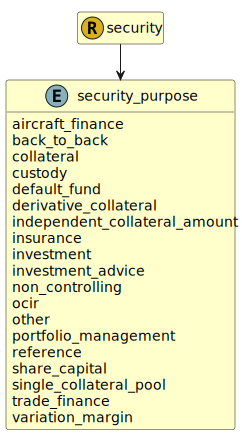

&lt;&nbsp; [Namespace](index.md)
#  fire.model.security_purpose
>  
>The purpose for which the security is being held.
> 

## Local Fields

| Name        | Description |
| ----------- | ----------- |
| aircraft_finance |   |
| back_to_back |   |
| collateral |   |
| custody |   |
| default_fund |   |
| derivative_collateral |   |
| independent_collateral_amount |   |
| insurance |   |
| investment |   |
| investment_advice |   |
| non_controlling |   |
| ocir |   |
| other |   |
| portfolio_management |   |
| reference |   |
| share_capital |   |
| single_collateral_pool |   |
| trade_finance |   |
| variation_margin |   |

 

### Referenced from fields in:
-  [fire.model.security](UDT-fire.model.security.md)
