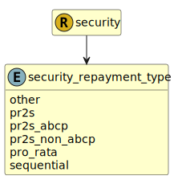

&lt;&nbsp; [Namespace](index.md)
#  fire.model.security_repayment_type
>  
>The repayment or amortisation mechanism of the security or securitisation.
> 

## Local Fields

| Name        | Description |
| ----------- | ----------- |
| other |   |
| pr2s |   |
| pr2s_abcp |   |
| pr2s_non_abcp |   |
| pro_rata |   |
| sequential |   |

 

### Referenced from fields in:
-  [fire.model.security](UDT-fire.model.security.md)
