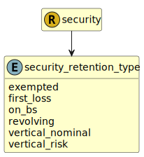

&lt;&nbsp; [Namespace](index.md)
#  fire.model.security_retention_type
>  
>The repayment or amortisation mechanism of the security or securitisation.
> 

## Local Fields

| Name        | Description |
| ----------- | ----------- |
| exempted |   |
| first_loss |   |
| on_bs |   |
| revolving |   |
| vertical_nominal |   |
| vertical_risk |   |

 

### Referenced from fields in:
-  [fire.model.security](UDT-fire.model.security.md)
