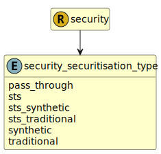

&lt;&nbsp; [Namespace](index.md)
#  fire.model.security_securitisation_type
>  
>The type of securitisation with regards to common regulatory classifications.
> 

## Local Fields

| Name        | Description |
| ----------- | ----------- |
| pass_through |   |
| sts |   |
| sts_synthetic |   |
| sts_traditional |   |
| synthetic |   |
| traditional |   |

 

### Referenced from fields in:
-  [fire.model.security](UDT-fire.model.security.md)
