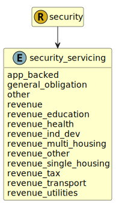

&lt;&nbsp; [Namespace](index.md)
#  fire.model.security_servicing
>  
>The method by which the debt shall be repaid
> 

## Local Fields

| Name        | Description |
| ----------- | ----------- |
| app_backed |   |
| general_obligation |   |
| other |   |
| revenue |   |
| revenue_education |   |
| revenue_health |   |
| revenue_ind_dev |   |
| revenue_multi_housing |   |
| revenue_other |   |
| revenue_single_housing |   |
| revenue_tax |   |
| revenue_transport |   |
| revenue_utilities |   |

 

### Referenced from fields in:
-  [fire.model.security](UDT-fire.model.security.md)
