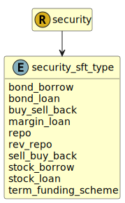

&lt;&nbsp; [Namespace](index.md)
#  fire.model.security_sft_type
>  
>The sft_type parameter defines the transaction mechanism conducted for the SFT for this security product.
> 

## Local Fields

| Name        | Description |
| ----------- | ----------- |
| bond_borrow |   |
| bond_loan |   |
| buy_sell_back |   |
| margin_loan |   |
| repo |   |
| rev_repo |   |
| sell_buy_back |   |
| stock_borrow |   |
| stock_loan |   |
| term_funding_scheme |   |

 

### Referenced from fields in:
-  [fire.model.security](UDT-fire.model.security.md)
