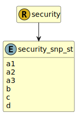

&lt;&nbsp; [Namespace](index.md)
#  fire.model.security_snp_st
>  
>S&P short term credit ratings
> 

## Local Fields

| Name        | Description |
| ----------- | ----------- |
| a1 |   |
| a2 |   |
| a3 |   |
| b |   |
| c |   |
| d |   |

 

### Referenced from fields in:
-  [fire.model.security](UDT-fire.model.security.md)
