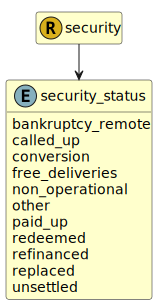

&lt;&nbsp; [Namespace](index.md)
#  fire.model.security_status
>  
>Provides additional information regarding the status of the security.
> 

## Local Fields

| Name        | Description |
| ----------- | ----------- |
| bankruptcy_remote |   |
| called_up |   |
| free_deliveries |   |
| non_operational |   |
| paid_up |   |
| unsettled |   |

 

### Referenced from fields in:
-  [fire.model.security](UDT-fire.model.security.md)
