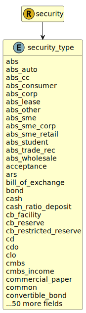

&lt;&nbsp; [Namespace](index.md)
#  fire.model.security_type
>  
>This is the type of the security with regards to common regulatory classifications.
> 

## Local Fields

| Name        | Description |
| ----------- | ----------- |
| abs |   |
| abs_auto |   |
| abs_cc |   |
| abs_consumer |   |
| abs_corp |   |
| abs_lease |   |
| abs_other |   |
| abs_sme |   |
| abs_sme_corp |   |
| abs_sme_retail |   |
| abs_trade_rec |   |
| abs_wholesale |   |
| acceptance |   |
| bill_of_exchange |   |
| bond |   |
| cash |   |
| cash_ratio_deposit |   |
| cb_facility |   |
| cb_reserve |   |
| cb_restricted_reserve |   |
| cd |   |
| cmbs |   |
| cmbs_income |   |
| commercial_paper |   |
| convertible_bond |   |
| covered_bond |   |
| debt |   |
| dividend |   |
| emtn |   |
| equity |   |
| financial_guarantee |   |
| financial_sloc |   |
| frn |   |
| guarantee |   |
| index |   |
| index_linked |   |
| letter_of_credit |   |
| main_index_equity |   |
| mbs |   |
| mtn |   |
| nha_mbs |   |
| other |   |
| performance_bond |   |
| performance_guarantee |   |
| performance_sloc |   |
| pibs |   |
| pref_share |   |
| rmbs |   |
| rmbs_income |   |
| rmbs_trans |   |
| share |   |
| share_agg |   |
| speculative_unlisted |   |
| spv_mortgages |   |
| spv_other |   |
| struct_note |   |
| treasury |   |
| urp |   |
| warranty |   |

 

### Referenced from fields in:
-  [fire.model.security](UDT-fire.model.security.md)
