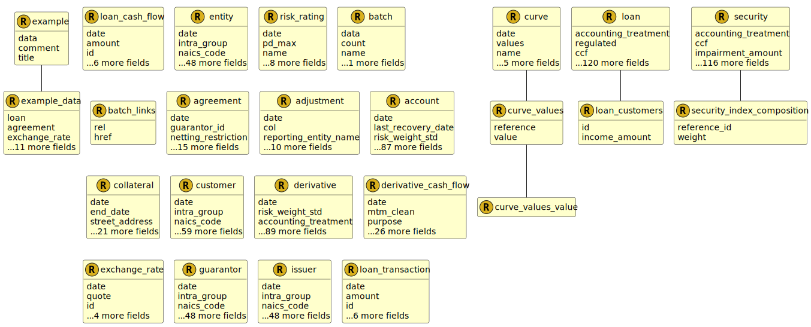

 

## Namespace : fire.model

[Sort by type](index.md)

| Name        | Summary |
| ----------- | ------- |
|  [account](UDT-fire.model.account.md) | An Account represents a financial account that describes the funds that a customer has entrusted to a financial institution in the form of deposits or credit balances. |
|  [account_base_rate](UDT-fire.model.account_base_rate.md) | The base rate represents the basis of the rate on the balance at the given date as agreed in the terms of the account. |
|  [account_capital_tier](UDT-fire.model.account_capital_tier.md) | The capital tiers based on own funds requirements. |
|  [account_encumbrance_type](UDT-fire.model.account_encumbrance_type.md) | The type of the encumbrance causing the encumbrance_amount. |
|  [account_guarantee_scheme](UDT-fire.model.account_guarantee_scheme.md) | The Government Deposit Scheme scheme under which the guarantee_amount is guaranteed. |
|  [account_interest_repayment_frequency](UDT-fire.model.account_interest_repayment_frequency.md) | Repayment frequency of the interest. |
|  [account_purpose](UDT-fire.model.account_purpose.md) | The purpose for which the account was created or is being used. |
|  [account_rate_type](UDT-fire.model.account_rate_type.md) | Describes the type of interest rate applied to the account. |
|  [account_status](UDT-fire.model.account_status.md) | Describes if the Account is active or been cancelled. |
|  [account_type](UDT-fire.model.account_type.md) | This is the type of the account with regards to common regulatory classifications. |
|  [account_uk_funding_type](UDT-fire.model.account_uk_funding_type.md) | Funding type calculated according to BIPRU 12.5/12.6 |
|  [accounting_treatment](UDT-fire.model.accounting_treatment.md) | The accounting treatment in accordance with IAS/IFRS9 accounting principles. |
|  [adjustment](UDT-fire.model.adjustment.md) |  |
|  [agreement](UDT-fire.model.agreement.md) | An agreement represents the standard terms agreed between two parties. |
|  [agreement_credit_support_type](UDT-fire.model.agreement_credit_support_type.md) | The type of credit support document |
|  [agreement_margin_frequency](UDT-fire.model.agreement_margin_frequency.md) | Indicates the periodic timescale at which variation margin is exchanged. Cleared derivatives which are daily settled can be flagged as daily_settled. |
|  [agreement_netting_restriction](UDT-fire.model.agreement_netting_restriction.md) | populated only if any netting restriction applies, in relation to the nature of the agreement or the enforceability of netting in the jurisdiction of the counterparty, preventing the recognition of the agreement as risk-reducing, pursuant to CRR Articles 295 to 298 |
|  [agreement_stay_protocol](UDT-fire.model.agreement_stay_protocol.md) | Indicates whether a stay protocol has been signed by one or both parties to the agreement. |
|  [agreement_type](UDT-fire.model.agreement_type.md) | The type of the master agreement. |
|  [asset_class](UDT-fire.model.asset_class.md) | The asset class to which the derivative belongs. |
|  [asset_liability](UDT-fire.model.asset_liability.md) | Is the data an asset, a liability, or equity on the firm's balance sheet? |
|  [batch](UDT-fire.model.batch.md) | FIRE schema for representing bulk collections of bank objects. |
|  [batch_links](UDT-fire.model.batch_links.md) |  |
|  [batch_links_rel](UDT-fire.model.batch_links_rel.md) |  |
|  [collateral](UDT-fire.model.collateral.md) | Data schema to define collateral (currently can reference loans or accounts). |
|  [collateral_encumbrance_type](UDT-fire.model.collateral_encumbrance_type.md) | The type of the encumbrance causing the encumbrance_amount. |
|  [collateral_type](UDT-fire.model.collateral_type.md) | The collateral type defines the form of the collateral provided |
|  [country_code](UDT-fire.model.country_code.md) | Two-letter country code as defined according to ISO 3166-1 plus ISO allowed, user-assignable codes (AA, QM to QZ, XA to XZ, and ZZ). |
|  [cr_approach](UDT-fire.model.cr_approach.md) | Specifies the approved credit risk rwa calculation approach to be applied to the exposure. |
|  [currency_code](UDT-fire.model.currency_code.md) | Currency in accordance with ISO 4217 standards plus CNH for practical considerations. |
|  [curve](UDT-fire.model.curve.md) | A Curve represents a series of points on a plot. Typically, interest rates, volatility or forward prices. |
|  [curve_type](UDT-fire.model.curve_type.md) | The curve type. |
|  [curve_values](UDT-fire.model.curve_values.md) |  |
|  [curve_values_reference](UDT-fire.model.curve_values_reference.md) | The reference item for the value. (x-axis) |
|  [customer](UDT-fire.model.customer.md) |  |
|  [customer_clearing_threshold](UDT-fire.model.customer_clearing_threshold.md) | Status of the clearing threshold as defined in EMIR |
|  [customer_dbrs_lt](UDT-fire.model.customer_dbrs_lt.md) | DBRS long term credit ratings |
|  [customer_dbrs_st](UDT-fire.model.customer_dbrs_st.md) | DBRS short term credit ratings |
|  [customer_fitch_lt](UDT-fire.model.customer_fitch_lt.md) | Fitch long term credit ratings |
|  [customer_fitch_st](UDT-fire.model.customer_fitch_st.md) | Fitch short term credit ratings |
|  [customer_internal_rating](UDT-fire.model.customer_internal_rating.md) | Categorization of unrated exposure |
|  [customer_kbra_lt](UDT-fire.model.customer_kbra_lt.md) | KBRA long term credit ratings |
|  [customer_kbra_st](UDT-fire.model.customer_kbra_st.md) | KBRA short term credit ratings |
|  [customer_moodys_lt](UDT-fire.model.customer_moodys_lt.md) | Moody's long term credit ratings |
|  [customer_moodys_st](UDT-fire.model.customer_moodys_st.md) | Moodys short term credit ratings |
|  [customer_nace_code](UDT-fire.model.customer_nace_code.md) | The EU NACE economic activity classification. |
|  [customer_relationship](UDT-fire.model.customer_relationship.md) | Relationship to parent. |
|  [customer_reporting_relationship](UDT-fire.model.customer_reporting_relationship.md) | Relationship to reporting entity. See: relationship. |
|  [customer_scra](UDT-fire.model.customer_scra.md) | Grade calculated using the Basel Standardised Credit Risk Assessment |
|  [customer_snp_lt](UDT-fire.model.customer_snp_lt.md) | S&P long term credit ratings |
|  [customer_snp_st](UDT-fire.model.customer_snp_st.md) | S&P short term credit ratings |
|  [customer_status](UDT-fire.model.customer_status.md) | The status of the relationship with the customer from the firm's point of view. |
|  [customer_type](UDT-fire.model.customer_type.md) | The designated financial or legal entity category this person or legal entity falls under |
|  [day_count_convention](UDT-fire.model.day_count_convention.md) | The methodology for calculating the number of days between two dates. It is used to calculate the amount of accrued interest or the present value. |
|  [derivative](UDT-fire.model.derivative.md) | A derivative is a contract which derives its value from an underlying reference index, security or asset. |
|  [derivative_base_rate](UDT-fire.model.derivative_base_rate.md) | The base rate represents the basis of the rate on the balance at the given date as agreed in the terms of the financial product. |
|  [derivative_cash_flow](UDT-fire.model.derivative_cash_flow.md) | A derivative cash flow where two parties exchange cash flows (or assets) derived from an underlying reference index, security or financial instrument. |
|  [derivative_cash_flow_leg](UDT-fire.model.derivative_cash_flow_leg.md) | The type of the payment leg. |
|  [derivative_cash_flow_purpose](UDT-fire.model.derivative_cash_flow_purpose.md) | The purpose for which the derivative cash flow is calculated |
|  [derivative_cash_flow_settlement_type](UDT-fire.model.derivative_cash_flow_settlement_type.md) | The type of settlement for the contract. |
|  [derivative_ccr_approach](UDT-fire.model.derivative_ccr_approach.md) | Specifies the approved counterparty credit risk methodology for calculating exposures. |
|  [derivative_leg_type](UDT-fire.model.derivative_leg_type.md) | Describe the payoff type of the derivative leg. |
|  [derivative_position](UDT-fire.model.derivative_position.md) | Specifies the market position, i.e. long or short, of the derivative leg |
|  [derivative_purpose](UDT-fire.model.derivative_purpose.md) | The purpose for which the derivative is being held. |
|  [derivative_settlement_type](UDT-fire.model.derivative_settlement_type.md) | The type of settlement for the contract. |
|  [derivative_status](UDT-fire.model.derivative_status.md) | Provides additional information regarding the status of the derivative. |
|  [derivative_type](UDT-fire.model.derivative_type.md) | This is the type of the derivative with regards to common regulatory classifications. |
|  [derivative_underlying_index_tenor](UDT-fire.model.derivative_underlying_index_tenor.md) | The designated maturity of the underlying interest rate index used in the underlying_index property for interest rate derivatives |
|  [entity](UDT-fire.model.entity.md) | Data schema to define a person or legal entity. |
|  [entity_dbrs_lt](UDT-fire.model.entity_dbrs_lt.md) | DBRS long term credit ratings |
|  [entity_dbrs_st](UDT-fire.model.entity_dbrs_st.md) | DBRS short term credit ratings |
|  [entity_fitch_lt](UDT-fire.model.entity_fitch_lt.md) | Fitch long term credit ratings |
|  [entity_fitch_st](UDT-fire.model.entity_fitch_st.md) | Fitch short term credit ratings |
|  [entity_internal_rating](UDT-fire.model.entity_internal_rating.md) | Categorization of unrated exposure |
|  [entity_kbra_lt](UDT-fire.model.entity_kbra_lt.md) | KBRA long term credit ratings |
|  [entity_kbra_st](UDT-fire.model.entity_kbra_st.md) | KBRA short term credit ratings |
|  [entity_moodys_lt](UDT-fire.model.entity_moodys_lt.md) | Moody's long term credit ratings |
|  [entity_moodys_st](UDT-fire.model.entity_moodys_st.md) | Moodys short term credit ratings |
|  [entity_nace_code](UDT-fire.model.entity_nace_code.md) | The EU NACE economic activity classification. |
|  [entity_relationship](UDT-fire.model.entity_relationship.md) | Relationship to parent. |
|  [entity_reporting_relationship](UDT-fire.model.entity_reporting_relationship.md) | Relationship to reporting entity. See: relationship. |
|  [entity_scra](UDT-fire.model.entity_scra.md) | Grade calculated using the Basel Standardised Credit Risk Assessment |
|  [entity_snp_lt](UDT-fire.model.entity_snp_lt.md) | S&P long term credit ratings |
|  [entity_snp_st](UDT-fire.model.entity_snp_st.md) | S&P short term credit ratings |
|  [entity_type](UDT-fire.model.entity_type.md) | The designated financial or legal entity category this person or legal entity falls under |
|  [example](UDT-fire.model.example.md) | FIRE schema for representing and validating FIRE examples |
|  [example_data](UDT-fire.model.example_data.md) |  |
|  [exchange_rate](UDT-fire.model.exchange_rate.md) | An Exchange Rate represents the conversion rate between two currencies. |
|  [guarantor](UDT-fire.model.guarantor.md) |  |
|  [guarantor_dbrs_lt](UDT-fire.model.guarantor_dbrs_lt.md) | DBRS long term credit ratings |
|  [guarantor_dbrs_st](UDT-fire.model.guarantor_dbrs_st.md) | DBRS short term credit ratings |
|  [guarantor_fitch_lt](UDT-fire.model.guarantor_fitch_lt.md) | Fitch long term credit ratings |
|  [guarantor_fitch_st](UDT-fire.model.guarantor_fitch_st.md) | Fitch short term credit ratings |
|  [guarantor_internal_rating](UDT-fire.model.guarantor_internal_rating.md) | Categorization of unrated exposure |
|  [guarantor_kbra_lt](UDT-fire.model.guarantor_kbra_lt.md) | KBRA long term credit ratings |
|  [guarantor_kbra_st](UDT-fire.model.guarantor_kbra_st.md) | KBRA short term credit ratings |
|  [guarantor_moodys_lt](UDT-fire.model.guarantor_moodys_lt.md) | Moody's long term credit ratings |
|  [guarantor_moodys_st](UDT-fire.model.guarantor_moodys_st.md) | Moodys short term credit ratings |
|  [guarantor_nace_code](UDT-fire.model.guarantor_nace_code.md) | The EU NACE economic activity classification. |
|  [guarantor_relationship](UDT-fire.model.guarantor_relationship.md) | Relationship to parent. |
|  [guarantor_reporting_relationship](UDT-fire.model.guarantor_reporting_relationship.md) | Relationship to reporting entity. See: relationship. |
|  [guarantor_scra](UDT-fire.model.guarantor_scra.md) | Grade calculated using the Basel Standardised Credit Risk Assessment |
|  [guarantor_snp_lt](UDT-fire.model.guarantor_snp_lt.md) | S&P long term credit ratings |
|  [guarantor_snp_st](UDT-fire.model.guarantor_snp_st.md) | S&P short term credit ratings |
|  [guarantor_type](UDT-fire.model.guarantor_type.md) | The designated financial or legal entity category this person or legal entity falls under |
|  [impairment_status](UDT-fire.model.impairment_status.md) | The recognition stage for the impairment/expected credit loss of the product. |
|  [impairment_type](UDT-fire.model.impairment_type.md) | The loss event resulting in the impairment of the loan. |
|  [issuer](UDT-fire.model.issuer.md) |  |
|  [issuer_dbrs_lt](UDT-fire.model.issuer_dbrs_lt.md) | DBRS long term credit ratings |
|  [issuer_dbrs_st](UDT-fire.model.issuer_dbrs_st.md) | DBRS short term credit ratings |
|  [issuer_fitch_lt](UDT-fire.model.issuer_fitch_lt.md) | Fitch long term credit ratings |
|  [issuer_fitch_st](UDT-fire.model.issuer_fitch_st.md) | Fitch short term credit ratings |
|  [issuer_internal_rating](UDT-fire.model.issuer_internal_rating.md) | Categorization of unrated exposure |
|  [issuer_kbra_lt](UDT-fire.model.issuer_kbra_lt.md) | KBRA long term credit ratings |
|  [issuer_kbra_st](UDT-fire.model.issuer_kbra_st.md) | KBRA short term credit ratings |
|  [issuer_moodys_lt](UDT-fire.model.issuer_moodys_lt.md) | Moody's long term credit ratings |
|  [issuer_moodys_st](UDT-fire.model.issuer_moodys_st.md) | Moodys short term credit ratings |
|  [issuer_nace_code](UDT-fire.model.issuer_nace_code.md) | The EU NACE economic activity classification. |
|  [issuer_relationship](UDT-fire.model.issuer_relationship.md) | Relationship to parent. |
|  [issuer_reporting_relationship](UDT-fire.model.issuer_reporting_relationship.md) | Relationship to reporting entity. See: relationship. |
|  [issuer_scra](UDT-fire.model.issuer_scra.md) | Grade calculated using the Basel Standardised Credit Risk Assessment |
|  [issuer_snp_lt](UDT-fire.model.issuer_snp_lt.md) | S&P long term credit ratings |
|  [issuer_snp_st](UDT-fire.model.issuer_snp_st.md) | S&P short term credit ratings |
|  [issuer_type](UDT-fire.model.issuer_type.md) | The designated financial or legal entity category this person or legal entity falls under |
|  [loan](UDT-fire.model.loan.md) | Data schema defining the characteristics of a loan product. |
|  [loan_administration](UDT-fire.model.loan_administration.md) | How the loan was administered by the lender. |
|  [loan_arrears_arrangement](UDT-fire.model.loan_arrears_arrangement.md) | The arrangement the lender has made with the borrower regarding the amount referenced in the arrears_balance. |
|  [loan_base_rate](UDT-fire.model.loan_base_rate.md) | The base rate represents the basis of the repayment rate on the borrowed funds at the given date as agreed in the terms of the loan. |
|  [loan_cash_flow](UDT-fire.model.loan_cash_flow.md) | A loan cash flow represents the future movement of cash as part of contractually agreed payments for an existing loan. |
|  [loan_cash_flow_type](UDT-fire.model.loan_cash_flow_type.md) | The type of the payment, signifying whether interest or principal is being paid. |
|  [loan_credit_process](UDT-fire.model.loan_credit_process.md) | Identifier for how a loan is credit assessed during the underwriting process |
|  [loan_customers](UDT-fire.model.loan_customers.md) |  |
|  [loan_encumbrance_type](UDT-fire.model.loan_encumbrance_type.md) | The type of the encumbrance causing the encumbrance_amount. |
|  [loan_income_assessment](UDT-fire.model.loan_income_assessment.md) | Was the loan assessed against a single or joint incomes? |
|  [loan_interest_repayment_frequency](UDT-fire.model.loan_interest_repayment_frequency.md) | Repayment frequency of the loan interest, if different from principal. |
|  [loan_movement](UDT-fire.model.loan_movement.md) | The movement parameter describes how the loan arrived to the firm. |
|  [loan_originator_type](UDT-fire.model.loan_originator_type.md) | The type of financial institution that acted as the originator of the loan product. |
|  [loan_provision_type](UDT-fire.model.loan_provision_type.md) | The provision type parameter details the provisions the issuing firm has allocated to cover potential losses from issuing a loan. |
|  [loan_purpose](UDT-fire.model.loan_purpose.md) | The underlying reason the borrower has requested the loan. |
|  [loan_rate_type](UDT-fire.model.loan_rate_type.md) | Describes the type of interest rate applied to the loan. |
|  [loan_repayment_frequency](UDT-fire.model.loan_repayment_frequency.md) | Repayment frequency of the loan. |
|  [loan_repayment_type](UDT-fire.model.loan_repayment_type.md) | Repayment type of the loan refers to whether the customer will be repaying capital + interest, just interest or a combination of the two. |
|  [loan_servicing](UDT-fire.model.loan_servicing.md) | The method by which the loan shall be repaid |
|  [loan_status](UDT-fire.model.loan_status.md) | Describes if the loan is active or been cancelled. |
|  [loan_transaction](UDT-fire.model.loan_transaction.md) | A Loan Transaction is an event that has an impact on a loan, typically the balance. |
|  [loan_transaction_type](UDT-fire.model.loan_transaction_type.md) | The type of impact on the balance of the loan. |
|  [loan_type](UDT-fire.model.loan_type.md) | The form of the loan product administered by the financial institution, with regards to common regulatory classifications. |
|  [regulatory_book](UDT-fire.model.regulatory_book.md) | The type of portfolio in which the instrument is held. |
|  [security](UDT-fire.model.security.md) | A security represents a tradable financial instrument held or financed by an institution for investment or collateral. |
|  [security_base_rate](UDT-fire.model.security_base_rate.md) | The base rate represents the basis of the rate on the balance at the given date as agreed in the terms of the financial product. |
|  [security_call_type](UDT-fire.model.security_call_type.md) | The call mechanism, if present, for the issuance. For securitisations and other callable securities. |
|  [security_capital_tier](UDT-fire.model.security_capital_tier.md) | The capital tiers based on own funds requirements. |
|  [security_ccr_approach](UDT-fire.model.security_ccr_approach.md) | Specifies the approved counterparty credit risk methodology for calculating exposures. |
|  [security_dbrs_lt](UDT-fire.model.security_dbrs_lt.md) | DBRS long term credit ratings |
|  [security_dbrs_st](UDT-fire.model.security_dbrs_st.md) | DBRS short term credit ratings |
|  [security_excess_spread_type](UDT-fire.model.security_excess_spread_type.md) | Excess spread |
|  [security_fitch_lt](UDT-fire.model.security_fitch_lt.md) | Fitch long term credit ratings |
|  [security_fitch_st](UDT-fire.model.security_fitch_st.md) | Fitch short term credit ratings |
|  [security_hqla_class](UDT-fire.model.security_hqla_class.md) | What is the HQLA classification of this security? |
|  [security_index_composition](UDT-fire.model.security_index_composition.md) |  |
|  [security_interest_repayment_frequency](UDT-fire.model.security_interest_repayment_frequency.md) | Repayment frequency of the interest. |
|  [security_kbra_lt](UDT-fire.model.security_kbra_lt.md) | KBRA long term credit ratings |
|  [security_kbra_st](UDT-fire.model.security_kbra_st.md) | KBRA short term credit ratings |
|  [security_moodys_lt](UDT-fire.model.security_moodys_lt.md) | Moody's long term credit ratings |
|  [security_moodys_st](UDT-fire.model.security_moodys_st.md) | Moodys short term credit ratings |
|  [security_movement](UDT-fire.model.security_movement.md) | The movement parameter describes how the security arrived to the firm. |
|  [security_purpose](UDT-fire.model.security_purpose.md) | The purpose for which the security is being held. |
|  [security_repayment_type](UDT-fire.model.security_repayment_type.md) | The repayment or amortisation mechanism of the security or securitisation. |
|  [security_retention_type](UDT-fire.model.security_retention_type.md) | The repayment or amortisation mechanism of the security or securitisation. |
|  [security_securitisation_type](UDT-fire.model.security_securitisation_type.md) | The type of securitisation with regards to common regulatory classifications. |
|  [security_seniority](UDT-fire.model.security_seniority.md) | The seniority of the security in the event of sale or bankruptcy of the issuer. |
|  [security_sft_type](UDT-fire.model.security_sft_type.md) | The sft_type parameter defines the transaction mechanism conducted for the SFT for this security product. |
|  [security_snp_lt](UDT-fire.model.security_snp_lt.md) | S&P long term credit ratings |
|  [security_snp_st](UDT-fire.model.security_snp_st.md) | S&P short term credit ratings |
|  [security_status](UDT-fire.model.security_status.md) | Provides additional information regarding the status of the security. |
|  [security_type](UDT-fire.model.security_type.md) | This is the type of the security with regards to common regulatory classifications. |
